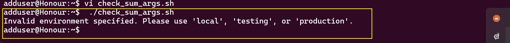
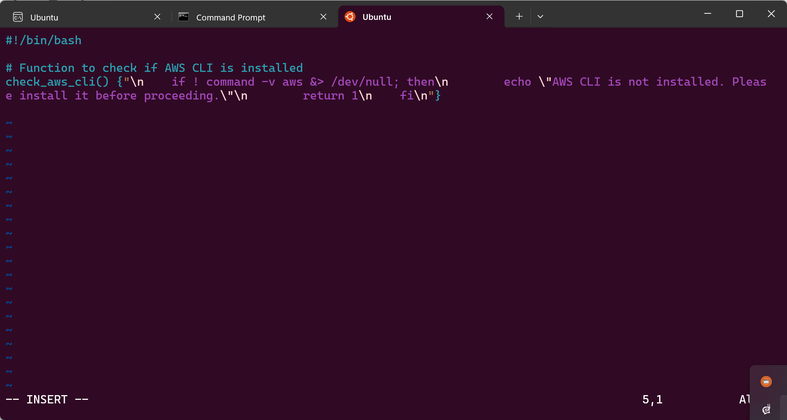
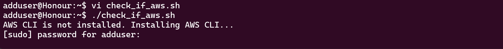
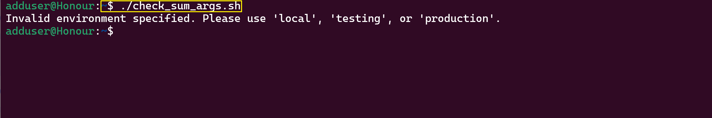
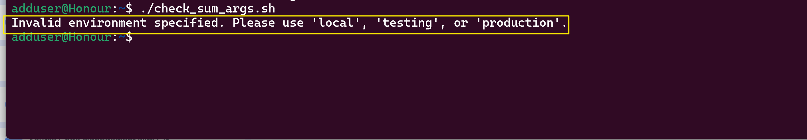

# S3 Object Creation Bash Script

## Project Overview

This project features a Bash script that automates the process of creating an object in an AWS S3 bucket. The script includes robust functions for argument validation, environment activation, AWS CLI installation verification, AWS profile checks, and S3 object creation. Each function is designed to demonstrate best practices in Bash scripting and AWS automation.

---

## Script Functions Explained

### 1. Argument Validation
**Description:**  
Ensures the user provides the correct number of arguments for the script to function properly.
> 1:**  
> _Insert screenshot of argument validation error/output here._
```
#!/bin/bash

check_num_of_args() {"\n# Checking the number of arguments\nif [ \"$#\" -ne 0 ]; then\n    echo \"Usage: $0 <environment>\"\n    exit 1\nfi\n"}

# Accessing the first argument
ENVIRONMENT=$1

# Acting based on the argument value
if [ "$ENVIRONMENT" == "local" ]; then
  echo "Running script for Local Environment..."
elif [ "$ENVIRONMENT" == "testing" ]; then
  echo "Running script for Testing Environment..."
elif [ "$ENVIRONMENT" == "production" ]; then
  echo "Running script for Production Environment..."
else
  echo "Invalid environment specified. Please use 'local', 'testing', or 'production'."
  exit 2
fi
```

### 2. Environment Activation
**Description:**  
Activates the selected environment (local, testing, production) and prints a confirmation message.
> 2:**  
> _Insert screenshot showing environment activation output here._

---

### 3. AWS CLI Installation Check
**Description:**  
Verifies that AWS CLI is installed; if not, prompts the user to install it.
> 3:**  
> _Insert screenshot showing AWS CLI check or installation prompt here._

---

### 4. AWS Profile Verification
**Description:**  
Checks if the AWS profile environment variable is set before attempting any AWS operations.
> 4:**  
> _Insert screenshot of AWS profile check result here._

---

### 5. Temporary File Creation
**Description:**  
Creates a temporary file to hold the content that will be uploaded to S3 as an object.
> 5:**  
> _Insert screenshot of temporary file creation or its contents here._

---

### 6. S3 Object Upload via AWS CLI
**Description:**  
Uses AWS CLI to upload the temporary file to the specified S3 bucket and key.
> 6:**  
> _Insert screenshot showing successful S3 upload command/output here._

---

### 7. S3 Upload Error Handling
**Description:**  
Handles and reports any errors during the S3 upload process.
   
   
   
> _Insert screenshot showing error message for failed upload here._

---

### 8. Script Exit Codes
**Description:**  
Implements clear exit codes for different types of errors, improving script robustness.
> 8:**  
> _Insert screenshot of exit code usage or error output here._

---

### 9. Command-Line Usage Instructions
**Description:**  
Displays usage instructions if the script is not run with correct arguments.
> 9:**  
> _Insert screenshot of usage instruction output here._

## Summary of Learnings

Through this project, I learned to write modular and robust Bash scripts that interact with AWS services, including argument validation, environment selection, and error handling. I gained practical experience in automating cloud operations and implementing best practices for script maintainability and user feedback.

```
